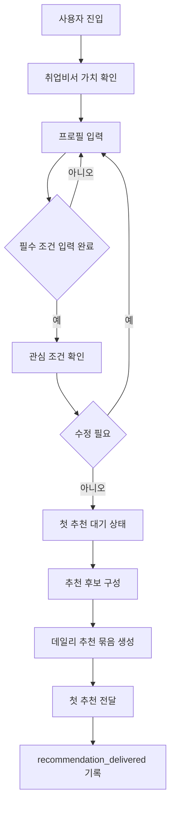
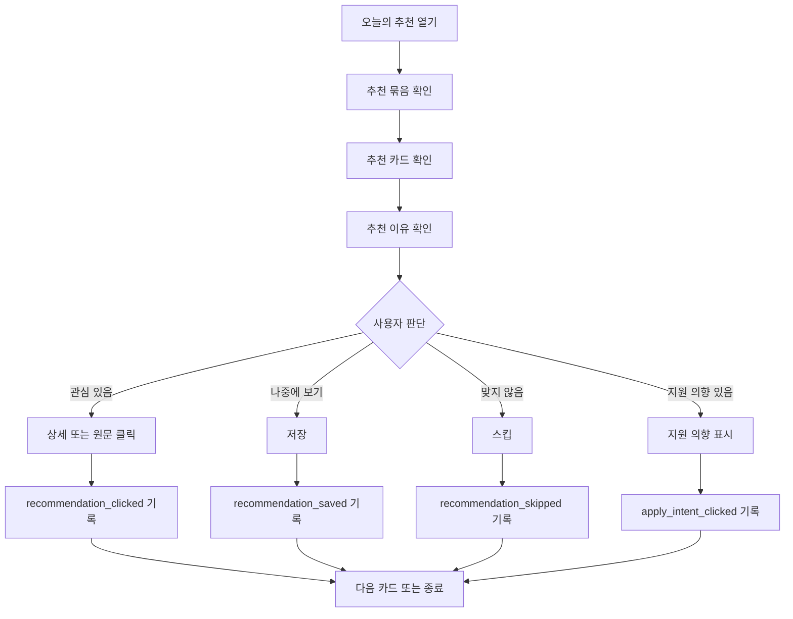
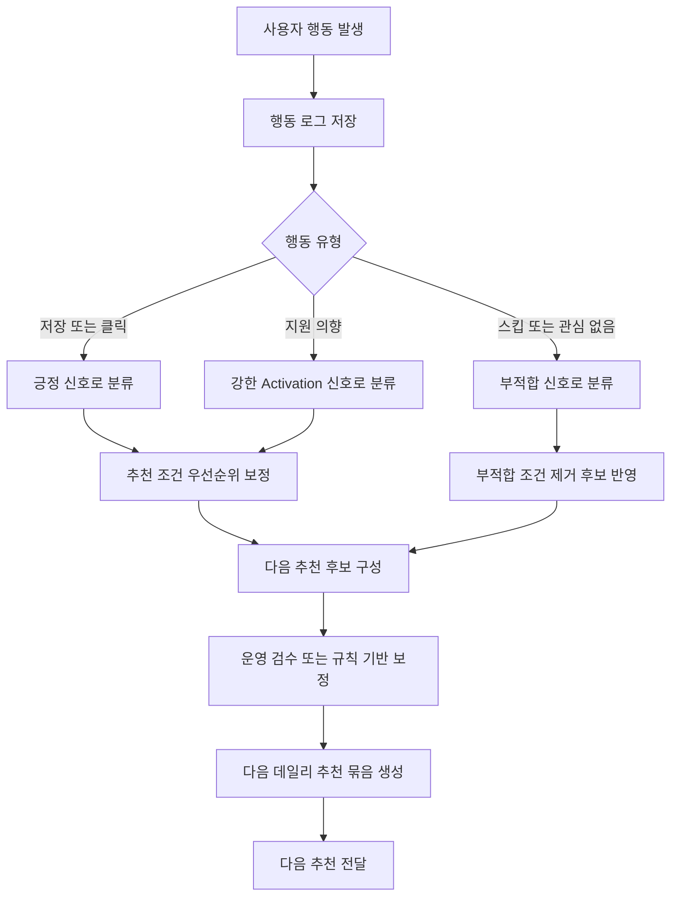

# Flow Chart

---

> 핵심 사용자 흐름을 플로우 차트로 정리한다.   
> 범위는 온보딩부터 첫 추천 전달, 데일리 추천 상호작용, 피드백이 다음 추천에 반영되는 루프까지다.  
> 차트는 제품 흐름을 설명하기 위한 초안이며,   
> production 데이터 엔진, 최종 발송 채널, RAG/LLM 파이프라인은 TBD.

## 플로우 1. 온보딩에서 첫 추천 전달까지

### 주요 판단

| 단계      | 사용자 목적       | 시스템 목적             | 추적 이벤트                   |
| ------- | ------------ | ------------------ | ------------------------ |
| 프로필 입력  | 내 조건을 전달한다   | 초기 추천 기준 확보        | profile_submitted        |
| 조건 확인   | 잘못된 조건을 수정한다 | 추천 오류 가능성 감소       | profile_confirmed        |
| 첫 추천 대기 | 언제 받을지 이해한다  | 첫 전달 기대 형성         | onboarding_completed     |
| 첫 추천 전달 | 추천을 받는다      | Activation 첫 단계 측정 | recommendation_delivered |

## 플로우 2. 데일리 추천 상호작용

### 주요 판단

| 행동    | 사용자 의미        | 시스템 해석           | 후속 처리               |
| ----- | ------------- | ---------------- | ------------------- |
| 클릭    | 더 알고 싶다       | 관심 신호            | 항목 관심도 증가           |
| 저장    | 나중에 볼 가치가 있다  | 강한 긍정 신호         | 저장 상태 반영            |
| 스킵    | 나와 맞지 않다      | 부적합 신호           | 조건 제외 또는 우선순위 하향 후보 |
| 지원 의향 | 실제 행동 가능성이 있다 | 핵심 Activation 신호 | 지원 의향 기록 또는 외부 이동   |

## 플로우 3. 피드백에서 다음 추천 개선까지

### 추천 개선 원칙

| 입력 신호 | 개선 방향            | 주의사항                      |
| ----- | ---------------- | ------------------------- |
| 오픈    | 전달 시간과 콘텐츠 관심 확인 | 오픈만으로 선호를 단정하지 않는다.       |
| 클릭    | 관심 항목 후보 강화      | 외부 이동 후 결과는 보장하지 않는다.     |
| 저장    | 비슷한 조건 우선 검토     | 저장만으로 지원 의사를 단정하지 않는다.    |
| 스킵    | 유사 부적합 조건 하향     | 스킵 사유가 없으면 과도하게 제외하지 않는다. |
| 지원 의향 | 의미 있는 첫 행동으로 측정  | 실제 지원 완료 추적은 별도 결정이 필요하다. |

## 예외 흐름

| 상황        | 사용자 안내                  | 처리                |
| --------- | ----------------------- | ----------------- |
| 프로필 미완료   | 추천을 위해 필요한 조건을 안내       | 온보딩으로 복귀          |
| 추천 후보 부족  | 오늘 제공 가능한 추천이 제한적임을 안내  | 운영 검수 또는 다음 후보 대기 |
| 외부 링크 변경  | 원문에서 최신 정보를 확인하라고 안내    | 클릭 이벤트만 기록        |
| 부적합 추천 반복 | 관심 조건 수정 또는 스킵 사유 입력 유도 | 다음 추천 보정 후보 반영    |

## Current Status

현재 검증 중심은 첫 전달, 첫 오픈, 첫 클릭 또는 저장, 첫 지원 의향.

## Conflict Notes

1. 수동 큐레이션과 자동화 엔진 경계가 미정이므로 개선 루프에는 운영 검수 또는 규칙 기반 보정 단계를 둔다.
2. RAG/LLM과 크롤링은 production 적용이 확정되지 않았으므로 차트에 기술 요소로 미반영.

## Open Questions

1. 첫 추천 전달 채널은 이메일, 웹, 알림 중 무엇으로 둘 것인가?
2. 추천 후보 부족 시 빈 상태를 어떻게 보여줄 것인가?
3. 스킵 사유를 반드시 받을 것인가, 선택으로 둘 것인가?
